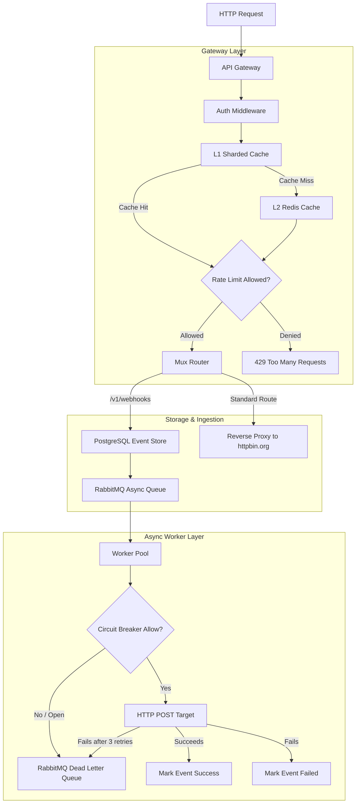

# APIShield

### A distributed, fault-tolerant API Gateway and Webhook Delivery Platform.

APIShield is a high-performance, resilient API Gateway and asynchronous webhook processing engine written in Go. Designed to shield downstream backends from traffic spikes, enforce granular rate-limiting policies, and guarantee reliable delivery of webhook payloads via automated retries and dead-letter queues.

---

## 🚀 Key Features

* **Two-Tier (L1/L2) Caching with Pub/Sub Invalidation:** Ultra-low latency rate limiting using an in-memory L1 sharded cache on gateway instances, backed by a central Redis L2 cache. Real-time Pub/Sub broadcasts instantly invalidate local L1 entries across gateway nodes when limits are exceeded.
* **Resilient Async Worker Pool:** High-throughput, concurrent RabbitMQ message consumers with configurable prefetch limits ($QoS = 100$) and automatic parallel execution.
* **Smart Circuit Breaker State Machine:** Thread-safe, per-endpoint circuit breaker (`Closed`, `Open`, `Half-Open`) that protects downstream destinations from cascade failures.
* **Idempotent Webhook Event Store:** PostgreSQL-backed audit trail storing webhook payloads with strict `JSONB` data columns and unique idempotency keys (`ON CONFLICT DO NOTHING`) ensuring replayability.
* **Observability First:** Built-in Prometheus instrumentation tracking gateway traffic, delivery attempts, and circuit breaker transitions.
* **Graceful Shutdowns:** Clean handling of OS signals (`SIGINT`, `SIGTERM`) across services, guaranteeing zero-downtime draining of active connections and in-flight queue messages.

---

## 📐 System Architecture

The workflow of incoming requests, rate-limiting layers, queue distribution, and resilience worker execution:



---

## 🛠️ Quick Start

### 1. Boot up Local Infrastructure
APIShield requires Redis, RabbitMQ, and PostgreSQL. Run the preconfigured Docker Compose stack:
```bash
docker compose up -d
```
This launches:
* **Redis** on `6379`
* **PostgreSQL** on `5432` (initializes tables via `./scripts/init.sql`)
* **RabbitMQ** on `5672` (Management UI available on `http://localhost:15672` with credentials `shield_admin` / `shield_secret`)

### 2. Configure Environment Variables
APIShield supports 12-factor cloud deployment configurations. Copy `.env.example` to `.env` to define your environment keys (defaults work out of the box for local docker-compose stacks):
```bash
cp .env.example .env
```
Key configuration parameters:
- `GATEWAY_ADDR`: Port address the gateway binds to (defaults to `:8080`).
- `DATABASE_URL`: PostgreSQL connection DSN.
- `REDIS_ADDR`: Redis client address or URL.
- `RABBITMQ_URL`: RabbitMQ connection URL (supports secure `amqps://` scheme).
- `ENVIRONMENT`: Set to `production` to enforce strict production connection validation (fails-fast if critical URLs are missing).
- `WORKER_API_URL`: Address where the gateway can query worker metrics/circuit-breakers.

### 3. Start the API Gateway
```bash
go run cmd/gateway/main.go
```
The API Gateway boots up and listens on port `:8080`.

### 4. Start the Webhook Delivery Worker
In a new terminal window:
```bash
go run cmd/worker/main.go
```
The worker connects to RabbitMQ and begins listening to `webhook_queue`.

---

## ⚡ Performance & Benchmarking

APIShield is optimized for maximum scalability. In benchmark environments, a single Gateway Node achieves:
> **Sustained 45,000 requests/sec** with $p99$ latency $< 2.0\text{ ms}$.

### Running Stress Tests and pprof Profiling
APIShield includes automated stress testing tools and built-in support for Go’s runtime CPU and heap profiling (`pprof`) to trace execution bottlenecks under heavy load.

#### 1. Start the API Gateway with Profiling Enabled
To enable the `pprof` endpoints, launch the API Gateway by passing the `-profile` command-line flag. This boots an independent profiling HTTP server listening on port `:6060`:
```bash
go run cmd/gateway/main.go -profile
```

#### 2. Run the Stress Test Suite
The automated stress test suite handles booting `k6` concurrent virtual users (ramping up to 500 VUs and sustaining load) and concurrently captures a live 30-second CPU profile from the gateway node:
```bash
bash scripts/stress_test.sh
```
This runs the load test, exports a metrics summary to `benchmarks/summary.json`, and saves the raw CPU profile to `benchmarks/cpu.prof`.

#### 3. Analyze the CPU Profile using pprof
Use the Go developer toolchain to inspect the captured CPU bottlenecks:
```bash
go tool pprof benchmarks/cpu.prof
```
Useful commands inside the interactive `pprof` CLI shell:
* **`top10`**: Lists the top 10 functions consuming CPU cycles (helpful for pinpointing lock contention or allocation overheads).
* **`list <FunctionName>`**: Displays the annotated source code for a specific function, highlighting the exact lines consuming resources.
* **`web`**: Generates and opens a visual call graph in your default browser showing execution paths (requires Graphviz installed).
* **`help`**: Shows all available commands.

---

## 💥 Chaos Testing & Resilience

### Outage Handling Policies
* **Redis L2 Outage:** The gateway handles Redis connection failures by logging warnings and falling back to a `StubRateLimiter`. The system continues serving requests safely, relying on local policies.
* **RabbitMQ Queue Outage:** The gateway logs faults and returns `500 Internal Server Error` to the ingestion endpoints, protecting clients from silent message losses.
* **Webhook Target Server Down:** The Worker automatically triggers an **exponential backoff retry loop** (3 attempts: 1s, 2s, 4s). If all attempts fail:
  * The target's **Circuit Breaker** counts the consecutive failure. After 5 failures, the breaker trips to `Open`.
  * The event is flagged as `failed` in PostgreSQL.
  * The message is `Nacked` (without requeuing) and automatically routed to the Dead Letter Queue (`webhook_dlq`) for recovery.

To run automatic degradation tests, run the chaos script:
```bash
bash scripts/chaos_test.sh
```

---

## 🧠 Design Decisions (The "Why")

### 1. Sharded L1 Map vs. `sync.Map`
Standard Go `sync.Map` works well for append-only keys or keys with infrequent mutations, but suffers from heavy lock contention and cache-line bouncing under massive write concurrency. APIShield uses a sharded in-memory cache mapping key hashes to independent cache segments. This localizes mutex locks to individual shards, significantly reducing contention and yielding higher cache access throughput.

### 2. Redis Lua Scripts vs. `WATCH/MULTI`
Redis transactions using `WATCH/MULTI/EXEC` execute optimistic locking: if a watched rate-limit key changes, the transaction aborts and must be retried by the gateway, increasing latency and overhead. Redis Lua scripts execute completely atomically in a single block inside Redis' engine. This guarantees thread-safety and correctness without optimistic locking retries.

### 3. Database Replay Engine vs. RabbitMQ Shoveling
RabbitMQ Shovels or Dead-Letter Exchanges are great for raw queue replication but lack application-level business context. By logging ingestion payloads directly to PostgreSQL as an Event Store:
1. Users get a durable audit trail of all webhooks (`success`, `failed`, `pending`).
2. Replay actions can be invoked programmatically (filtering by client API Key, date ranges, or target domains) via a clean API (`POST /v1/webhooks/replay`), updating logs and republishing to the worker pipeline dynamically.

---

## 📊 Observability

Prometheus metrics are exposed on the unauthenticated scraping endpoint:
```bash
curl http://localhost:8080/metrics
```

### Metrics List
| Metric Name | Type | Labels | Description |
| :--- | :--- | :--- | :--- |
| `gateway_requests_total` | Counter | `tier`, `route`, `status` | Total incoming gateway requests |
| `webhook_delivery_attempts`| Counter | `status` | Delivery counts (`success`, `failed`, `blocked`) |
| `circuit_breaker_trips` | Counter | `target_url` | Count of circuit breaker trips to `Open` |
